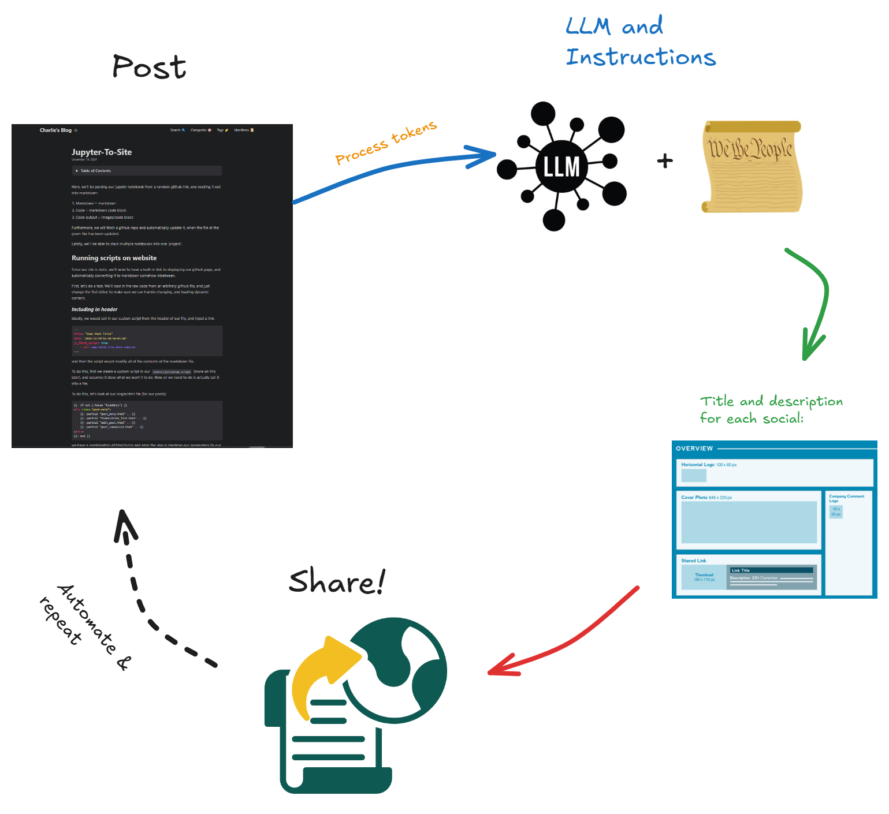
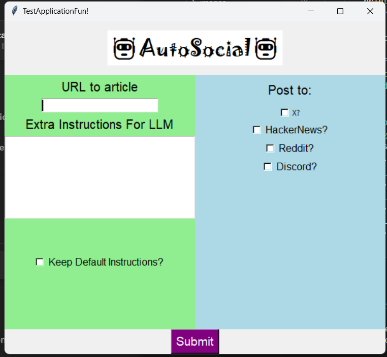

# autosocial
Automatically posts to all desired socials, finetuned LLM writes appealing/good titles and descriptions for each platform.

GUI:

Watch video:

# Part 1: Posting

First, let's understand each social-media that we'll want to post to:
- How we make the post (API/other workaround for automatic post)
- What format it expects (title, description, subtitle, etc.)

The platforms I want to use:
- Hackernews
- Reddit
- X
- Medium
- Discord

--> For future
- Youtube (shorts,post) 
- Instagram (shorts,post)

## Part 2: LLM & Instructions, GUI
Next, I'd like to create an instruction-set/prompt for the LLM we choose to use, that makes it write an appealing summary/description of our post. The pipeline will be:

- Give LLM post and instructions (with gui?)
- Take LLM's post, and post it with the format we find in the previous step

## Part 3: Track metrics
Automatically track the metrics for our post (as provided by the platform), and have a dashboard to see the metrics for each post.

Also, maybe have a system for integrating the comments across all socials, or at least displaying some of the metrics shared across all platforms on each platform, and also provide links to each other platform that it was posted on!

## Conclusion: Working with AI like future

Write the conclusion about how you think AI will revoultionize communication, from governments/poltics, to reaching out to people. Will social and speaking abilities be rendered irrelevant?